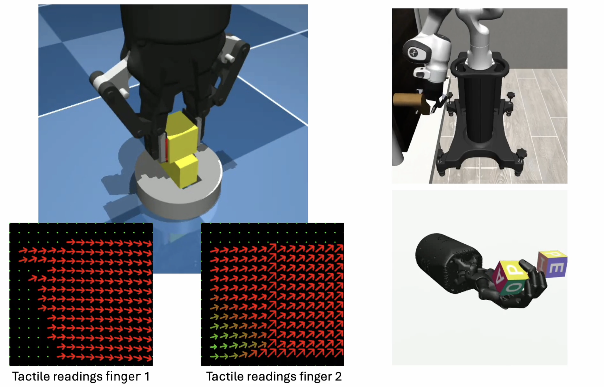

# tactile_envs

Collection of MuJoCo robotics environments equipped with both vision and tactile sensing. <br> The environments are built on top of Gymnasium.




Current available environments:
* `tactile_envs/Insertion-v0` (see [Insertion](scripts/test_env_insertion.py))
* `Door` (see [Door](scripts/test_env_door.py))
* `HandManipulateBlockRotateZFixed-v1` (see [HandManipulateBlockRotateZFixed](scripts/test_env_hand.py))
* `HandManipulateEggRotateFixed-v1` (see [HandManipulateEggRotateFixed](scripts/test_env_hand.py))
* `HandManipulatePenRotateFixed-v1` (see [HandManipulatePenRotateFixed](scripts/test_env_hand.py))

## Installation
To install `tactile_envs` in a fresh conda env:
```
conda create --name tactile_envs python=3.11
conda activate tactile_envs
pip install -r requirements.txt
```

Before running the environment code, make sure that you generate the tactile sensor collision meshes for the desired resolution. E.g., for 32x32 sensors:
``` bash
python tactile_envs/assets/insertion/generate_pad_collisions.py --nx 32 --ny 32
```


## Preparation
### 3D Model Coordinate Transformation
To rotate and transform the coordinate of tactile sensor .stl file, run:
``` bash
python STL_trans/stl_trans.py
```
### Markers Coordinate Transformation
run: `python tactile_envs/assets/insertion/markers/scripts/coordinate_trans.py`

### Modify and Generate Sensor Pads Configurations
The script `generate_pads_collisions.py` generates custom XML files for pad collisions based on marker coordinates from a CSV file. It allows users to configure parameters such as the number of rows and columns of markers, the scaling factor, and the size of each tactile pad. You can modify parameters including `--num_rows`, `--num_cols`, `--scale`, `--size_x`, `--size_y`, `--size_z`. 
Example Usage: 
``` bash
python tactile_envs/assets/insertion/generate_pads_collisions.py --num_rows 20 --num_cols 20 --scale 0.0011
```

### Modify Other Simulation Configurations
In the files below you can modify object attributes, movement modes, etc. Refer to files:
1. `tactile_envs/envs/insertion.py`
2. `tactile_envs/assets/insertion/scene.xml`


## Test the available environment:
The script `test_env_grip.py` tests a gripping environment with tactile and visual information using `gymnasium` and `tactile_envs`. The main function, `test_env`, simulates robotic gripping tasks where you can control key environment parameters such as the number of episodes, steps, state type (e.g., `vision_and_touch`, `vision`, `touch`), and image size through command-line arguments.
### Example Usage
``` bash
python scripts/test_env_grip.py --n_episodes 50 --n_steps 500 --show_highres --state_type vision_and_touch
```
This command runs 50 episodes, with 500 steps per episode, using tactile information only and high-resolution images.
Available parameters including: `--n_episodes`, `--n_steps`, `--show_highres`, `--seed`, `--env_name`, `--state_type`, `--multiccd`, `--im_size`, `--no_gripping`, `--no_rotation`, `--tactile_shape`, `--max_delta`. To see all available options and defaults, use:
``` bash
python scripts/test_env_grip.py --help
```


## Citation
If you use these environments in your research, please cite the following paper:
```
@article{sferrazza2023power,
  title={The power of the senses: Generalizable manipulation from vision and touch through masked multimodal learning},
  author={Sferrazza, Carmelo and Seo, Younggyo and Liu, Hao and Lee, Youngwoon and Abbeel, Pieter},
  year={2023}
}
```

## Additional resources
Are you interested in more complex robot environments with high-dimensional tactile sensing? Check out [HumanoidBench](https://github.com/carlosferrazza/humanoid-bench)!

## References
This codebase contains some files adapted from other sources:
* Gymnasium-Robotics: https://github.com/Farama-Foundation/Gymnasium-Robotics
* robosuite: https://github.com/ARISE-Initiative/robosuite/tree/master
* TactileSimulation: https://github.com/eanswer/TactileSimulation
